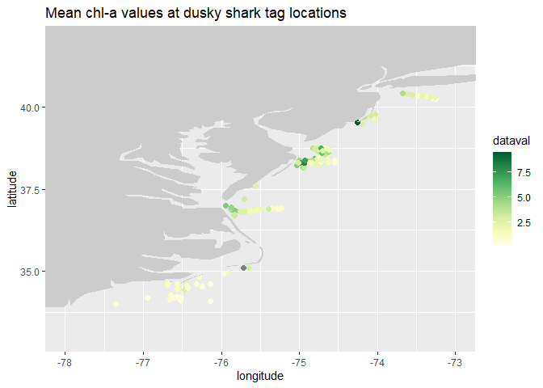

# Satellite data matchups to ship tracks or animal tags

> notebook filename \|
> matchup_satellite_fish_tracks_activities_coded.Rmd history \| Created
> May 2021 - converted to R notebook from xyt_matchup.R history \|
> Created Apr 2022 - modified for ECN Fish-tracking class from
> matchup_satellite_track_data.Rmd history \| Created Aug 2022 -
> modified from matchup_satellite_fish_tracks.Rmd to show example coding
> approach for in-class activities and homework assignment

In this exercise you will extract satellite data around a set of points
defined by longitude, latitude, and time coordinates like that produced
by an animal telemetry tag, and ship track, or a glider track.

The exercise demonstrates the following techniques:

-   Using the **rxtracto** function to extract satellite data along a
    track (rxtracto is a function in the **rerddapXtracto** package) .
-   Using the **rerddap** package to retrieve information about a
    satellite dataset from an ERDDAP data server.
-   Using **plotTrack** to plot the satellite data onto a map as well as
    to make an animation (plotTrack is a function in the
    **rerddapXtracto** package).
-   Using **ggplot** to plot the satellite data onto a map
-   Loading tag data from a comma separated file and subsetting the tag
    data by transmitter or year. IMPORTANT: the tag data has been
    pre-formatted into Date, Transmitter, Latitude, Longitude columns.

The satellite data for this exercise is available on the ERDDAP servers
listed in the data sets list provided with the class materials. These
ERDDAP servers are managed by NOAA CoastWatch, for example:
<https://coastwatch.noaa.gov/erddap/>

## Install required packages and load libraries

``` r
# Function to check if pkgs are installed, and install any missing pkgs

pkgTest <- function(x)
{
  if (!require(x,character.only = TRUE))
  {
    install.packages(x,dep=TRUE,repos='http://cran.us.r-project.org')
    if(!require(x,character.only = TRUE)) stop(x, " :Package not found")
  }
}

# create list of required packages
list.of.packages <- c("graphics", "ggplot2", "gifski", "mapdata", "maps", 
                      "ncdf4", "parsedate", "plotdap", "png",
                      "ragg", "RColorBrewer", "rerddap", "rerddapXtracto")

# create list of installed packages
pkges = installed.packages()[,"Package"]

# Install and load all required pkgs
for (pk in list.of.packages) {
  pkgTest(pk)
}
```

## Get XYT coordinates

In this exercise we will load animal tag XYT coordinates from a file.
The tracks are of several tagged dusky sharks along the U.S. east coast,
courtesy of Dr. Chuck Bangley of the Smithsonian Environmental Research
Center. For more info, see:

Bangley, C.W., et al. 2020. Identifying Important Juvenile Dusky Shark
Habitat in the Northwest Atlantic Ocean Using Acoustic Telemetry and
Spatial Modeling. Marine and Coastal Fisheries 12:348–363. DOI:
10.1002/mcf2.10120

``` r
# Set your working directory, i.e. the directory where you've put this R code and the tag datafile:
setwd("~/CW_Satel_Training_Class/2022 Fish-Tracking")

# Dusky shark tag data from Chuck Bangley (SERC)
infile <- 'DuskyDaily_NOAAclass_sortedTransmitterDate.csv'
#infile <- 'CNR_daily_positions_NOAAclass_sortedTransmitterDate.csv'

# Read the tag data (csv file format)
tagdata <- read.csv(infile,head=TRUE,sep=",");

# View the structure of the tagdata object (it is an R data frame)
str(tagdata)
```

    ## 'data.frame':    417 obs. of  6 variables:
    ##  $ Transmitter        : chr  "A69-1601-46065" "A69-1601-46065" "A69-1601-46065" "A69-1601-46065" ...
    ##  $ Date               : chr  "9/15/2017" "9/27/2017" "10/2/2017" "10/8/2017" ...
    ##  $ Latitude           : num  38.2 38.3 38.3 38.7 38.5 ...
    ##  $ Longitude          : num  -75 -75 -75 -74.8 -74.7 ...
    ##  $ X                  : logi  NA NA NA NA NA NA ...
    ##  $ Unique.Transmitters: chr  "A69-9006-16095" "A69-9001-16950" "A69-9006-16094" "A69-1601-46078" ...

We will use the “Date”, “Longitude” and “Latitude” variables to get the
matching satellite data.

Often date information needs to be converted into a different date
format. (Remember R syntax is Y for a 4 digit year and y for a 2 digit
year.)

``` r
# Read the tagdata column values 
## For convenience make shorter names for the variables  
xcoord <- tagdata$Longitude
#xcoord <- tagdata$Mean.Longitude
ycoord <- tagdata$Latitude
#ycoord <- tagdata$Mean.Latitude
tcoord <- tagdata$Date

# Notice the date format is in m/d/YYYY format.
# Change the date format to the format required for the rxtracto function:
#    YYYY-mm-dd, which is what is returned by as.Date
tcoord <- as.character(as.Date(tcoord, "%m/%d/%Y"))
```

## Select the satellite dataset and download its metadata from ERDDAP

For this example we will use the Aqua MODIS 8-day average chlorophyll
global 4km dataset (Dataset ID: erdMH1chla8day)

which is located on this ERDDAP server:
<https://coastwatch.pfeg.noaa.gov/erddap/>

**The script below:**

-   Gathers information about the dataset (metadata) using **rerddap**  
-   Displays the information

**Set the following arguments for rerddap**

-   url - the ERDDAP server
-   dataset - the dataset ID

``` r
url <- "https://coastwatch.pfeg.noaa.gov/erddap/"
dataset <- 'erdMH1chla8day'

# Alternates (using WCN ERDDAP server):
#url <- "https://coastwatch.pfeg.noaa.gov/erddap/"
#dataset <- 'nesdisVHNSQchlaWeekly' # Suomi-NPP VIIRS weekly chlorophyll, global 4km
#dataset <- 'pmlEsaCCI50OceanColorMonthly'  # OC-CCI Chlorophyll, Monthly

# Use rerddap to get dataset metadata 
# if you encouter an error reading the nc file clear the rerrdap cache: 
#rerddap::cache_delete_all(force = TRUE)
dataInfo <- rerddap::info(dataset,url=url)

# Display the metadata
dataInfo
```

    ## <ERDDAP info> erdMH1chla8day 
    ##  Base URL: https://coastwatch.pfeg.noaa.gov/erddap 
    ##  Dataset Type: griddap 
    ##  Dimensions (range):  
    ##      time: (2003-01-05T00:00:00Z, 2022-06-14T00:00:00Z) 
    ##      latitude: (-89.97917, 89.97916) 
    ##      longitude: (-179.9792, 179.9792) 
    ##  Variables:  
    ##      chlorophyll: 
    ##          Units: mg m-3

## Extract the satellite data

-   Check dataInfo to make sure the satellite dataset covers the time,
    longitude, and latitude ranges in your XYT tag data.

-   Use the name of the chlorophyll parameter that was displayed above
    in dataInfo: parameter \<- “chlorophyll”

-   Use the xcoord, ycoord, and tcoord vectors you extracted from the
    dusky shark tag file. For a single individual, subset the xcoord,
    ycoord, tcoord vectors using the individual’s transmitter number.

-   Look at dataInfo in the dimensions list to see if the dataset has an
    altitude dimension.

-   This satellite dataset does not have an altitude dimension. If an
    altitude dimension does appear in the satellite dataset, then
    **zcoord must be included in the rxtracto call**. Note that if
    zcoord needs to be given, it must be of the same length as the other
    coordinates. Also, a “zlen” can be specified, like ”xlen” and
    “ylen”, that defines a bounding box within which to make the
    extract. The advantage of this is it allows rxtracto() to make
    extracts moving in (x, y, z, t) space.

-   Define the search “radius” for the satellite data. The rxtracto
    function allows you to set the “radius” (x & y dimensions of a box)
    used to average the satellite data around the track points. Use the
    rxtracto xlen and ylen arguments. The values for xlen and ylen are
    in degrees. For our example we use 0.2 degrees for both arguments.
    Note: You can also submit vectors for xlen and ylen, as long as the
    are the same length as xcoord, ycoord, and tcoord

-   Run the rxtracto function to extract the data from ERDDAP.

``` r
parameter <- 'chlorophyll'  # Chlorophyll, Aqua MODIS
#Alternate:
#parameter <- 'chlor_a'    # Chlorophyll, Suomi-NPP VIIRS

# Some satellite datasets have an altitude dimension. If the dataInfo shows an altitude dimension, then zcoord must be included in the rxtracto call. 
zcoord <- rep(0., length(xcoord))

# Define the search "radius" for the satellite data in the x any y directions, in units of degrees. The satellite data values will be averaged for all satellite grid cells within the radius.
xlen <- 0.2
ylen <- 0.2

# Extract the satellite values for all shark tracks
weekly_chl <- rxtracto(dataInfo, 
                     parameter=parameter, 
                     xcoord=xcoord, ycoord=ycoord,
                     tcoord=tcoord, xlen=xlen, ylen=ylen)

# Alternate: Chlorophyll, Suomi-NPP VIIRS
# (this DOES have an altitude dimension, so include zcoord)
#weekly_chl <- rxtracto(dataInfo, parameter = parameter, 
#                                   xcoord = xcoord, 
#                                   ycoord = ycoord, 
#                                   zcoord = zcoord, 
#                                   tcoord = tcoord, 
#                                   xlen=xlen, ylen=ylen)
```

After the extraction is complete, “weekly_chl” will contain the
following columns.

``` r
str(weekly_chl)
```

    ## List of 13
    ##  $ mean chlorophyll  : num [1:417] 3.861 4.126 6.905 3.232 0.836 ...
    ##  $ stdev chlorophyll : num [1:417] 1.61 1.099 2.496 1.14 0.175 ...
    ##  $ n                 : int [1:417] 24 24 26 36 10 5 2 26 36 26 ...
    ##  $ satellite date    : chr [1:417] "2017-09-18T00:00:00Z" "2017-09-26T00:00:00Z" "2017-10-04T00:00:00Z" "2017-10-04T00:00:00Z" ...
    ##  $ requested lon min : num [1:417] -75.1 -75.1 -75.1 -74.9 -74.8 ...
    ##  $ requested lon max : num [1:417] -74.9 -74.9 -74.9 -74.7 -74.6 ...
    ##  $ requested lat min : num [1:417] 38.1 38.2 38.2 38.6 38.4 ...
    ##  $ requested lat max : num [1:417] 38.3 38.4 38.4 38.8 38.6 ...
    ##  $ requested z min   : logi [1:417] NA NA NA NA NA NA ...
    ##  $ requested z max   : logi [1:417] NA NA NA NA NA NA ...
    ##  $ requested date    : chr [1:417] "2017-09-15" "2017-09-27" "2017-10-02" "2017-10-08" ...
    ##  $ median chlorophyll: num [1:417] 3.542 4.276 7.449 3.044 0.901 ...
    ##  $ mad chlorophyll   : num [1:417] 1.641 1.13 2.961 1.252 0.108 ...
    ##  - attr(*, "row.names")= chr [1:417] "1" "2" "3" "4" ...
    ##  - attr(*, "class")= chr [1:2] "list" "rxtractoTrack"

``` r
#List of 13
# $ mean chlorophyll  : num [1:417] 3.861 4.126 6.905 3.232 0.836 ...
# $ stdev chlorophyll : num [1:417] 1.61 1.099 2.496 1.14 0.175 ...
# $ n                 : int [1:417] 24 24 26 36 10 5 2 26 36 26 ...
# $ satellite date    : chr [1:417] "2017-09-18T00:00:00Z" "2017-09-26T00:00:00Z" "2017-10-04T00:00:00Z" "2017-10-04T00:00:00Z" ...
# $ requested lon min : num [1:417] -75.1 -75.1 -75.1 -74.9 -74.8 ...
# $ requested lon max : num [1:417] -74.9 -74.9 -74.9 -74.7 -74.6 ...
# $ requested lat min : num [1:417] 38.1 38.2 38.2 38.6 38.4 ...
# $ requested lat max : num [1:417] 38.3 38.4 38.4 38.8 38.6 ...
# $ requested z min   : logi [1:417] NA NA NA NA NA NA ...
# $ requested z max   : logi [1:417] NA NA NA NA NA NA ...
# $ requested date    : chr [1:417] "2017-09-15" "2017-09-27" "2017-10-02" "2017-10-08" ...
# $ median chlorophyll: num [1:417] 3.542 4.276 7.449 3.044 0.901 ...
# $ mad chlorophyll   : num [1:417] 1.641 1.13 2.961 1.252 0.108 ...
# - attr(*, "row.names")= chr [1:417] "1" "2" "3" "4" ...
# - attr(*, "class")= chr [1:2] "list" "rxtractoTrack"
```

## Plotting the results

We will use the ‘plotTrack’ function to plot the results.  
\* ‘plotTrack’ is a function of the *rerddapXtracto* package designed
specifically to plot the results from ‘rxtracto’.

-   The example below uses a color palette specifically designed for
    chlorophyll.

``` r
# PlotTrack may not show the image. If so, uncomment this png line and 
# the dev.off() line (below) to save the image
#png(file="chl_data_vals_at_shark_tag_locations.png")

plotTrack(weekly_chl, xcoord, ycoord, tcoord, plotColor = 'algae')
```

<!-- -->

``` r
#dev.off()
#Possible error in dev.off() : cannot shut down device 1 (the null device)
#if(dev.cur() > 1) dev.off()
```

## Animating the tracks

Make a cumulative animation of the tracks. It will take several minutes
to collect the data into an animation-encoded image (because there are
417 total location points). After the image encoding completes, the
animation will run in the Rstudio viewer window.

``` r
#plotTrack(weekly_chl, xcoord, ycoord, tcoord, plotColor = 'algae', animate = TRUE, cumulative = TRUE)
```

## Map Method 2: ggplot graphics

Note that ‘plotTrack’, the routine used in the example above, is
designed to easily plot the output from ‘rxtracto’.

‘ggplot’ is part of the *ggplot2* package and allows a great deal more
variation in how the plot looks.

Put the tag lat, long and chl values into a dataframe for passing to
ggplot. Title the new dataframe’s columns: x, y, dataval.

Use the *map_data* package to select a base map.

(An alternative to *ggplot2* for geographic mapping is the *ggmap*
package.)

``` r
alltags <- data.frame( x=xcoord, y=ycoord, dataval=weekly_chl$'mean chlorophyll' )
# Alternate: Chlorophyll, Suomi-NPP VIIRS
#alltags <- data.frame( x=xcoord, y=ycoord, dataval=weekly_chl$'mean chlor_a' )

mapWorld <- map_data("world")
```

Make the map.

You can determine the map bounding coordinates by finding the min and
max lat/lon coordinates in the tag data file.

``` r
mapplot <- ggplot(alltags) + 
  geom_point( aes( x, y, color=dataval ), size=2. ) + 
  geom_polygon( data = mapWorld, aes(x=long, y=lat, group=group), fill="grey80" ) +
  coord_cartesian( xlim = c(-78,-73), ylim = c(33,42) ) + 
  scale_color_gradientn( colours = brewer.pal(n = 8, name = "YlGn") ) + 
  labs( x="longitude", y="latitude" ) + 
  ggtitle("Mean chl-a values at dusky shark tag locations")

# Display the map plot in the RStudio plot window
mapplot
```

<!-- -->

**To select or manipulate colors in the RColorBrewer palettes** \* This
site is useful for working with the RColorBrewer palettes:
<https://www.datanovia.com/en/blog/the-a-z-of-rcolorbrewer-palette/>

**Here is an alternate map** allowing a different colorscale & labeling,
and the map’s latitude and longitude labels have been removed.

For this method, you’ll need to determine the maximum chlorophyll value.
Colors are in hexadecimal notation.

Note the function differences (see more in R help documentation): \*
‘scale_color_gradient’ creates a two colour gradient (low-high) \*
‘scale_color_gradient2’ creates a diverging colour gradient
(low-mid-high) \* ‘scale_color_gradientn’ creates a n-colour gradient
(most palettes)

``` r
# Set NAs to -1 to find max chlorophyll value
alltags$dataval[is.na(alltags$dataval)] <- -1
maxval <- max(alltags$dataval)
maxval
```

    ## [1] 9.449549

``` r
# Redraw the map
mapplot <- ggplot(alltags) + 
  geom_point( aes( x, y, color=dataval ), size=2. ) + 
  geom_polygon(data = mapWorld, aes(x=long, y=lat, group=group), fill="grey80") + 
  coord_cartesian( xlim = c(-78,-73), ylim = c(33,42) ) + 
  # alternate colorscale & labeling with parameter & units
  scale_colour_gradient( limits=c(0.,maxval), high = "#3DFF33", low = "#FFFF66", "Chl-a, mg m^-3") +
  # without x & y labels
  labs( x="", y="" ) +
  ggtitle("Mean chl-a values at dusky shark tag locations")

mapplot
```

<!-- -->

## To change the dimensions of the mapplot graphic

-   name the pngfile
-   use the ‘agg_png’ function from the *ragg* package to set alternate
    dimensions, select the units and resolution (dpi)
-   below are 2 methods to do this. The first uses ‘agg_png’ directly,
    the second uses ‘ggsave’ from the *ggplot2* package to call an
    agg_png graphics device.

**If you have another method to rescale graphics, please use what you’re
familiar with**

``` r
## This method writes the graphic png file to a subdirectory of your working directory.
## Check the contents of the 'pngfile' variable for the subdirectory location.
#pngfile <- fs::path(knitr::fig_path(), "ggplot_chl_DuskyShark_rescale.png")
#str(pngfile)
#agg_png( pngfile, width = 6, height = 8, units = "cm", res = 300 )
#plot(mapplot)
#invisible(dev.off())
#knitr::include_graphics(pngfile)

pngfile <- "ggplot_chl_3_DuskyShark_rescale.png"
ggsave(
  pngfile, 
  mapplot, 
  device = agg_png, 
  width = 6, height = 8, units = "cm", res = 300,
  scale = 2, pointsize = 6,
  #path = "dusky_shark_graphics" 
  # use the 'path' argument to specify a subdirectory of your working directory for 
  # writing the graphic png file (the default is your working directory)
)
```

**For more on scaling ggplot2 graphics:**
<https://www.tidyverse.org/blog/2020/08/taking-control-of-plot-scaling/>

## Subsetting all tags for a single shark

Use a single shark’s transmitter number to extract just one shark’s
locations.

The R ‘which’ function will return the vector’s index values for the
single shark’s transmitter number. Then using the index, subset the
“alltags” data frame for just the single shark. Put the subsetted
columns into a new data frame.

``` r
transm <- tagdata$Transmitter
shark1 <- transm[1]    # selects the first value from transm
shark1                 # displays the transmitter number
```

    ## [1] "A69-1601-46065"

``` r
shark1_index <- which(transm == shark1)

# Create the data frame with lon, lat and chl for the single shark
single_shark <- data.frame ( x_shark = alltags$x[shark1_index], y_shark = alltags$y[shark1_index], dataval_shark = alltags$dataval[shark1_index])
```

## Alternate method for subsetting all tags for individual sharks

Another way to subset the tag data file for individual sharks is to use
R’s ‘subset’ function. We would need to include the column of
transmitter numbers in the “alltags” data frame.

This method may make more sense when you need to easily refer to a
transmitter number later, although both methods can be modified to write
a loop for extracting a shark’s information one shark at a time.

``` r
# From above:
#transm <- tagdata$Transmitter
alltags <- data.frame( x=xcoord, y=ycoord, dataval=weekly_chl$'mean chlorophyll', transmitter=transm )

# From above:
#shark1 <- transm[1]

# R subset function has 3 arguments: the data frame, the rows for the condition we want, the columns we want returned for that condition
single_shark <- subset(alltags, transmitter == shark1, select = c("x","y","dataval"))

# Renaming the columns of "single_shark" to be consistent with earlier example
colnames(single_shark) <- c('x_shark','y_shark','dataval_shark')
```

## Plotting the single shark’s location points onto a map

Use ‘ggplot’ to plot the single shark’s locations. We cannot use
‘plotTrack’ because we created a new data frame with the subsetted data;
‘plotTrack’ only works on output from ‘rxtracto’.

``` r
# Because there's only one shark, resize the map to zoom in on 
# this shark's location points
maplonmax <- max(single_shark$x_shark)
maplonmin <- min(single_shark$x_shark)
maplatmax <- max(single_shark$y_shark)
maplatmin <- min(single_shark$y_shark)

# Use ggplot to see the single shark's positions
mapplot_shark1 <- ggplot(single_shark) + 
    geom_point( aes( x_shark, y_shark, color=dataval_shark), size=2. ) + 
    geom_polygon(data=mapWorld, aes(x=long, y=lat, group=group), fill="grey80") + 
    coord_cartesian( xlim = c(maplonmin, maplonmax), ylim = c(maplatmin, maplatmax) ) + 
    scale_color_gradientn(colours=brewer.pal(n = 8, name = "YlGn")) + 
    labs(x="", y="") +
    ggtitle("Mean chl-a values for dusky shark #1 ")

mapplot_shark1
```

<!-- -->

``` r
# Rescale the map and write the graphic as a png file
pngfile <- "ggplot_chl_DuskyShark_shark1.png"
ggsave(
  pngfile, 
  mapplot_shark1, 
  device = agg_png, 
  width = 6, height = 8, units = "cm", res = 300,
  scale = 2, pointsize = 6,
  #path = "dusky_shark_graphics" 
  # use the 'path' argument to specify a subdirectory of your working directory for 
  # writing the graphic png file (the default is your working directory)
)
```

## Plotting track lines between the single shark’s location points

Use the ‘geom_segment’ function from the *ggplot2* package. The points
will display the chlorophyll values with lines between the points.

Note: for a shark’s (transmitter’s) total N points, there are N-1
tracks. To verbalize this in terms of selecting the start and end points
of the track lines:

The first point (lon,lat) is the start of the first track segment, and
the second point (lon,lat) is the end of the first track segment. The
second point is also the START of the second track segment, and the
third point is the END of the second track segment… and so on… until…
The next-to-last point is the start of the last segment, and the last
point is the end of the last segment.

``` r
# The start and end points of the track lines for all of the single shark's locations
start_lon <- single_shark$x_shark[ 1:length(single_shark$x_shark) -1 ]
start_lat <- single_shark$y_shark[ 1:length(single_shark$y_shark) -1 ]
end_lon <- single_shark$x_shark[ 2:length(single_shark$x_shark) ]
end_lat <- single_shark$y_shark[ 2:length(single_shark$y_shark) ]

# Note there are N-1 location points for drawing the track lines
str(start_lon)
```

    ##  num [1:33] -75 -75 -75 -74.8 -74.7 ...

``` r
# Overwrite the track layer onto the previous map plot.
# Use the 'geom_segment' function of ggplot.
#    - the 'data' argument to geom_segment must have data values in a data frame
#      (if it's not, use 'as.data.frame' to convert a matrix to a data frame).
# Use the chlorophyll values from "single_shark" but only use N-1 values.
mapplot_shark1_tracks <- mapplot_shark1 +
    #geom_segment( data = single_shark$dataval_shark[1:33], aes( x = start_lon, y = start_lat, xend = end_lon, yend = end_lat ))
    geom_segment( data = as.data.frame(single_shark$dataval_shark[1:33]), aes( x = start_lon, y = start_lat, xend = end_lon, yend = end_lat ))

mapplot_shark1_tracks
```

<!-- -->

``` r
# Rescale the map and write the graphic as a png file
pngfile <- "ggplot_chl_DuskyShark_shark1_tracks.png"
ggsave(
  pngfile, 
  mapplot_shark1_tracks, 
  device = agg_png, 
  width = 6, height = 8, units = "cm", res = 300,
  scale = 2, pointsize = 6,
  #path = "dusky_shark_graphics"
)
```

## Drawing a boxplot to understand more about the first shark’s conditions

Use R’s ‘boxplot’ function. To understand how chlorophyll varies between
the first and second years, divide the shark’s locations by year.

``` r
# Add the date information from the tag data file to the single_shark data frame.
# From above:
#   1) We already have the date information in the tcoord variable
#   2) We already have the index values of the first shark
#      i.e., shark1_index <- which(transm == shark1)
date_shark <- tcoord[shark1_index]
single_shark$date_shark <- date_shark

# Subset the shark's chlorophyll values by year
shark1_2017 <- subset(single_shark, format(as.Date(date_shark),"%Y")==2017)
shark1_2018 <- subset(single_shark, format(as.Date(date_shark),"%Y")==2018)

# Draw the boxplot
boxplot(shark1_2017$dataval_shark, shark1_2018$dataval_shark,
        main = "Shark1 chlorophyll",
        names = c("2017","2018"),
        col = c("green"),
        xlab = "Year",
        ylab = "Chl, mg/cm^3",
        at = c(1,3)  
        # 'at' argument draws boxplots at positions 1,3 with a space in the middle
        )
```

<!-- -->

Another way to do this is to extract just the year values from the
date_shark column, put the year values into its own column, and then use
the **formula feature (\~)** of the boxplot function to group
chlorophyll by year.

``` r
single_shark$year <- format(as.Date(single_shark$date_shark),"%Y")

boxplot(dataval_shark~year,     # "~" groups dataval_shark by year
        data = single_shark,
        main = "Shark1 chlorophyll",
        names = c("2017","2018"),
        col = c("green"),
        xlab = "Year",
        ylab = "Chl, mg/cm^3"
)
```

<!-- -->

## In-Class Activity

1)  Make a map of SST values at the first shark’s positions. Use the
    satellite SST dataset listed in
    ERDDAP_Satellite_Datasets_for_Activities.docx to obtain the ERDDAP
    server and DatasetID for the call to rerddap. Tip: for the ggplot
    map, switch the color palette to ‘OrRd’.

2)  Compare your result with the result from the interpolate tool
    (ERDDAP homework).

For more practice:

3)  Using the same satellite SST dataset as in (1), and a shark you
    haven’t already used, add the new shark’s positions to the map. Tip:
    You may need to resize the map after adding the second shark to your
    data frame.

4)  Using the map in (3), overlay track lines, using a different track
    color for each shark. Tip: The geom_segment function takes optional
    arguments such as “color” or “linetype”, for example, geom_segment(
    data=…, aes…, color = “red”, linetype = “dashed” )

``` r
sst_url <- 'https://coastwatch.noaa.gov/erddap/'
sst_dataset <- 'noaacrwsstDaily'
sst_dataInfo <- rerddap::info( sst_dataset, url=sst_url )

# Find the parameter name in the metadata and assign it to a variable
sst_parameter <- 'analysed_sst'

# When calling rxtracto, it will be more efficient for the ERDDAP server to just 
# retrieve the sst values for the first shark, rather than all sharks like we did 
# above for chlorophyll
sst_daily_crw <- rxtracto(sst_dataInfo, 
                     parameter=sst_parameter, 
                     xcoord=single_shark$x_shark, 
                     ycoord=single_shark$y_shark, 
                     #zcoord=zcoord,
                     tcoord=date_shark, 
                     xlen=xlen, ylen=ylen)

sst_single_shark <- data.frame ( x_shark = single_shark$x_shark, y_shark = single_shark$y_shark, sst_dataval = sst_daily_crw$'mean analysed_sst')

mapplot_shark1_sst <- ggplot(sst_single_shark) + 
    geom_point( aes( x_shark, y_shark, color=sst_dataval), size=2. ) + 
    geom_polygon(data=mapWorld, aes(x=long, y=lat, group=group), fill="grey80") + 
    coord_cartesian( xlim = c(maplonmin, maplonmax), ylim = c(maplatmin, maplatmax) ) + 
    scale_color_gradientn(colours=brewer.pal(n = 8, name = "OrRd")) + 
    labs(x="", y="") +
    ggtitle("Mean SST values for dusky shark #1 ")

mapplot_shark1_sst
```

<!-- -->

``` r
# Rescale the map and write the graphic as a png file
pngfile <- "ggplot_sst_1_DuskyShark_shark1.png"
ggsave(
  pngfile, 
  mapplot_shark1_sst, 
  device = agg_png, 
  width = 6, height = 8, units = "cm", res = 300,
  scale = 2, pointsize = 6,
)
```

``` r
# Get a second shark and draw its SST on the same map as shark1
# - the 5th shark could be interesting, transmitter # A69-1601-46078

shark2_index <- which(transm == 'A69-1601-46078')
str(shark2_index)
```

    ##  int [1:10] 70 71 72 73 74 75 76 77 78 79

``` r
sst_daily_crw_shark2 <- rxtracto(sst_dataInfo, 
                           parameter=sst_parameter, 
                           xcoord=alltags$x[shark2_index], 
                           ycoord=alltags$y[shark2_index], 
                           #zcoord=zcoord,
                           tcoord=tcoord[shark2_index], 
                           xlen=xlen, ylen=ylen)

# Create a data frame compatible with the 1st shark's data frame (sst_single_shark)
# i.e. the two data frames must have the same columns & column headings for 
# lon, lat and sst value
shark2_sst <- data.frame ( x_shark = alltags$x[shark2_index], y_shark = alltags$y[shark2_index], sst_dataval = sst_daily_crw_shark2$'mean analysed_sst')

# Put the data frames for shark1 & shark2 into one stacked data frame for plotting
# both on the same map
shark_1_2_sst <- rbind(sst_single_shark, shark2_sst)
str(shark_1_2_sst)
```

    ## 'data.frame':    44 obs. of  3 variables:
    ##  $ x_shark    : num  -75 -75 -75 -74.8 -74.7 ...
    ##  $ y_shark    : num  38.2 38.3 38.3 38.7 38.5 ...
    ##  $ sst_dataval: num  22.4 22.1 22.2 21.6 21.6 ...

``` r
# Determine map lat/lon min & max
maplonmax_1_2 <- max(shark_1_2_sst$x_shark)
maplonmin_1_2 <- min(shark_1_2_sst$x_shark)
maplatmax_1_2 <- max(shark_1_2_sst$y_shark)
maplatmin_1_2 <- min(shark_1_2_sst$y_shark)

# Draw the map
mapplot_shark_1_2_sst <- ggplot(shark_1_2_sst) + 
    geom_point( aes( x_shark, y_shark,
                     color=sst_dataval ), size=2. ) + 
    geom_polygon(data=mapWorld, aes(x=long, y=lat, group=group), fill="grey80") + 
    coord_cartesian( xlim = c(maplonmin_1_2, maplonmax_1_2), 
                     ylim = c(maplatmin_1_2, maplatmax_1_2) ) + 
    scale_color_gradientn(colours=brewer.pal(n = 8, name = "OrRd")) + 
    labs(x="", y="") +
    ggtitle("Mean SST values for sharks #1 & #2")

mapplot_shark_1_2_sst
```

<!-- -->

``` r
# Rescale the map and write the graphic as a png file
pngfile <- "ggplot_sst_2_DuskyShark_sharks_1_2.png"
ggsave(
  pngfile, 
  mapplot_shark_1_2_sst, 
  device = agg_png, 
  width = 9, height = 8, units = "cm", res = 300,
  scale = 2, pointsize = 6,
)
```

``` r
# Add track lines for both sharks, with a different color for each shark
# - first determine the two sharks' track start/end lat & lon values

start_lon_shark1 <- shark_1_2_sst$x_shark[ 1:33 ]
start_lat_shark1 <- shark_1_2_sst$y_shark[ 1:33 ]
end_lon_shark1 <- shark_1_2_sst$x_shark[ 2:34 ]
end_lat_shark1 <- shark_1_2_sst$y_shark[ 2:34 ]

start_lon_shark2 <- shark_1_2_sst$x_shark[ 35:43 ]
start_lat_shark2 <- shark_1_2_sst$y_shark[ 35:43 ]
end_lon_shark2 <- shark_1_2_sst$x_shark[ 36:44 ]
end_lat_shark2 <- shark_1_2_sst$y_shark[ 36:44 ]

mapplot_shark_1_2_sst_tracks <- mapplot_shark_1_2_sst +
  geom_segment( data = as.data.frame(shark_1_2_sst$sst_dataval[1:33]), 
                aes( x = start_lon_shark1, y = start_lat_shark1, 
                     xend = end_lon_shark1, yend = end_lat_shark1 ),
                color = 'blue', linetype = 'dotted' ) +
  geom_segment( data = as.data.frame(shark_1_2_sst$sst_dataval[35:43]), 
                aes( x = start_lon_shark2, y = start_lat_shark2, 
                     xend = end_lon_shark2, yend = end_lat_shark2 ),
                color = 'green', linetype = 'dashed' )

mapplot_shark_1_2_sst_tracks
```

<!-- -->

``` r
# Rescale the map and write the graphic as a png file
pngfile <- "ggplot_sst_3_DuskyShark_sharks_1_2_tracks.png"
ggsave(
  pngfile, 
  mapplot_shark_1_2_sst_tracks, 
  device = agg_png, 
  width = 9, height = 8, units = "cm", res = 300,
  scale = 2, pointsize = 6,
)
```

## Homework Week 2

1)  Create a map where time is represented for the sharks’ positions or
    tracks. You may use a single shark, multiple sharks, or all sharks.
    Here are two possible methods, but feel free to come up with your
    own method.

<!-- -->

1)  Determine length of time between a shark’s positions and plot the
    positions using colors to represent the passage of time. Include a
    color scale in the legend. Try labeling the tick marks for time.

2)  Group one or more sharks’ positions by month and plot the positions
    using colors to represent the months. There are several methods for
    grouping values in the class examples. Tip: The RColorBrewer
    ‘Paired’ color palette will give you 12 discrete colors.

<!-- -->

2)  Complete as much of the In-Class Activity above as your time
    permits. This will give you practice analyzing the movement of
    multiple sharks, identifying each of them with different track
    lines.

If you like, make an image file of one or more of your maps (png, jpeg,
etc) and upload them to the Slack discussion forum.

``` r
# For this exercise, we don't need an environmental parameter. So let's extract just
# the date, lat, lon for the two sharks above and add a third shark that seems to
# move over a large area. Shark with transmitter # A69-9006-16087 seems to fill this
# description.

# We already have shark1_index and shark2_index from above. Add shark3_index:
shark3 <- 'A69-9006-16087'
shark3_index <- which(transm == shark3)

# Let's make a clean data frame with just the data we need
sharks_1_2_3 <- data.frame ( 
  date_shark=c( tcoord[shark1_index], tcoord[shark2_index], tcoord[shark3_index]), 
  x_shark = c( xcoord[shark1_index], xcoord[shark2_index], xcoord[shark3_index]),
  y_shark = c( ycoord[shark1_index], ycoord[shark2_index], ycoord[shark3_index]) )

# Method (b): grouping sharks by month 
# - identify the months and add them as a separate month column
# - note these are character values which is helpful for discrete color scales
sharks_1_2_3$month <- format(as.Date(sharks_1_2_3$date_shark),"%m")

# Determine map lat/lon min & max (with 3 sharks, the area could be bigger than
# one or two sharks)
maplonmax_123 <- max(sharks_1_2_3$x_shark)
maplonmin_123 <- min(sharks_1_2_3$x_shark)
maplatmax_123 <- max(sharks_1_2_3$y_shark)
maplatmin_123 <- min(sharks_1_2_3$y_shark)

# Draw a map of months at the 3 sharks' lat/lon positions
# - the scale_color_brewer function uses the RColorBrewer palettes on discrete values
#   (compare this with the scale_color_distiller and scale_color_fermenter functions
#   that use the RColorBrewer palettes on continuous and binned values, respectively)
mapplot_sharks123_month <- ggplot(sharks_1_2_3) + 
    geom_point( aes( x_shark, y_shark, color=month ), size=2. ) + 
    geom_polygon(data=mapWorld, aes(x=long, y=lat, group=group), fill="grey80") + 
    coord_cartesian( xlim = c(maplonmin_123, maplonmax_123),
                     ylim = c(maplatmin_123, maplatmax_123) ) + 
    scale_color_brewer( palette = "Paired", "Months" ) +
    labs(x="", y="") +
    ggtitle("Monthly position for dusky sharks # 1,2,3")

mapplot_sharks123_month
```

<!-- -->

``` r
# Rescale the map and write the graphic as a png file
pngfile <- "ggplot_time_DuskyShark_sharks_123_month.png"
ggsave(
  pngfile, 
  mapplot_sharks123_month, 
  device = agg_png, 
  width = 6, height = 8, units = "cm", res = 300,
  scale = 2, pointsize = 6,
)
```

## Homework Week 3: Class project

1)  For your assigned parameter, use its DatasetID and the ERDDAP server
    Make-a-Graph interface to explore your parameter. You may also use
    the CoastWatch Data Portal if you prefer. How does your parameter
    change in time and space? Make some time series plots to look at
    different time scales, e.g. intraseasonal, seasonal, interannual.
    For spatial changes, you may try comparing how values differ between
    coastal and open-ocean areas, for example.

2)  Come up with several meaningful *spatial regions* or *temporal
    divisions* based on your parameter. ‘Meaningful’ is as you define it
    based on what you see in the parameter data and the shark positions.
    You’ll need at least 2 regions or temporal divisions (you may use
    more if that’s meaningful to the data). To support your choices,
    make some maps and/or time series plots of your parameter from the
    ERDDAP Make-a-Graph interface or the CoastWatch Data Portal.

3)  Draw boxplots (or histograms, or other visualization of statistical
    spread, the method is up to you) of your parameter for the different
    regions or temporal divisions. Be able to discuss how the
    parameter’s summary statistics differ between the regions or
    temporal divisions. *OR*, be able to discuss that you found this
    parameter’s statistics don’t substantively differ and what you might
    try differently.

4)  Consider this homework to be a minimum assignment – do as much of a
    research project as your time permits and based on your experience
    and comfort. *Example 1:* if you tried one or just a few sharks, try
    expanding the number of sharks. *Example 2:* try another parameter
    and see how the two parameters yield contrasting or complementary
    findings about the species.

5)  Make an image file of your boxplots, and be prepared with a short
    summary of your results to discuss with the other members of your
    parameter group. It will help if you also include some image files
    of the maps and/or time series plots from Step 2.

In class, you will discuss findings in a breakout session with your
parameter group. The group will then report back to the class on a
consensus finding about the species, using screen share to show some
results supporting the group’s findings. Each group will upload a few
key images of the group’s results to Slack or email the images to the
instructors (including maps, time series plots and/or boxplots as
appropriate).
